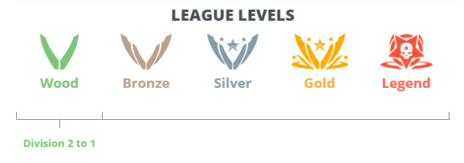
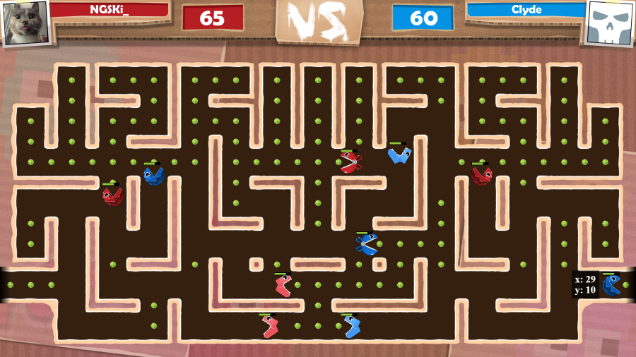
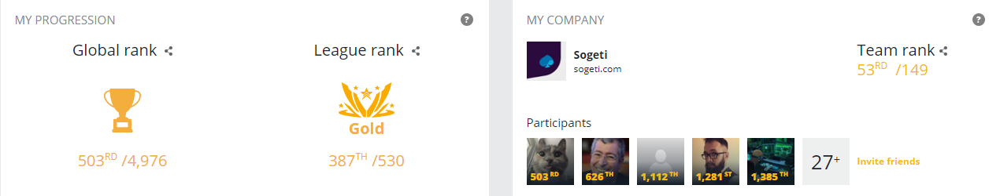

# Overview
The Spring Challenge is a coding competition on [CodinGame](https://www.codingame.com/home). The 2020 session was a 11 days challenge from the 7th to the 18th of May. The subject was to code the logic of a Pacman-like bot to make decisions and beat an adversary on 1 versus 1 game. The competition is entirely online and the players can submit their new code as many times as they want.

# Rules
## The ranking system
Each participant competes on an individual ranking system but can also participate with a team if they add their university or company on their CodinGame profile. The team ranking system is based on the 5 best players to calculate the team score.

The ranking is cut out in leagues :

All the players start in the Wood II league at the beginning.

Once the code is submitted, the player automatically plays games (even if disconnected) against the other players in the same league. The more games won, the higher the player climb. 

Each league (except Legend) has a bot in it that the players need to beat to get to the superior league. To beat the bot, you have to be ranked above it by beating more players than it in your league. Once you are above the bot, a few minutes later you'll pass to the next league.

## The code
The players can choose the language they want to use for the competition among many available languages. There is only one file where the player can code before submitting it.

A player can't copy the code of another player or they will be both disqualified of the competition. You still can exchange some ideas with your teams or help other players to fix bugs in their code.

## The game
The game is based on the famous Pacman game.

In order to win a game, you have to get more score than your opponent. You get 1 point for each pellet you eat with a pac and 10 points for the big ones. If both players have the same score, it's a tie.

The game is a turn by turn, for each turn the player receives the current data from the input console and send the next moves in the output console.

If you fail to provide the next action within the time limit of the turn, you will timeout and you may lose the game. The first round has a 1000 ms limit and the next ones have a 50 ms limit.
Plus there is a maximum of 200 turns for a game, the player with the biggest score win then.

A player can also watch any game that was played to debug your code or improve his strategy.

In the first league (Wood I), you have only one pac to command and you can see all the board with all the pellets, your pac and the enemy pac. There are collisions between pacs and they can't go through another pac.

Some leagues add new rules :

- Wood II : 
  - You will start with more pacs (between 2 and 5)
  
- Bronze : 
  - The pacs now have a type (rock, paper or scissors), if a pac collides with an enemy pac, it may eat it (rock > scissors > paper > rock). The pacs can still collide if they have the same type or if they are on the same team.
  
  - The pacs are able to use two abilities.
    - Switch allows the pac to change its type (you have to chose which one).
    - Speed will boost the pac by giving the possibility of moving of 2 cases each turn for the 5 next turns. 
  
    When a pac uses an ability, it can't move during the next turn and a 10 turns cooldown is applied before being able to use the next ability.

  - You still can "see" the shape of the map and the big pellets all the time but you will be able to see the small pellets and enemies only if they are in the vision of one of your alive pac. The vision works in line from your pac and is blocked by walls.

- Silver
  - The type of a pac will now indicate "DEAD" when it's been eaten by an enemy.

# My competition
## The experience

I decided to use the Java language because it's the language I'm the most familiar with as a back developer. 

My strategy was to see the map as pipes and intersections that I would detect and save on the first round (because we have more calculations time in this round). Basically, if a case has more than 2 possible way out, it's an intersection, otherwise it's part of a pipe. That allowed me to reduce the chances of blocking my pacs in the same intersection or pipe by giving priority to the first entering it.

Another point was to focus big pellets at the early game, on the first round I calculate the most efficient way to pick them up for each pac (ally and enemy) to focus only the one I'm sure to get and with the closest pac (2 big pellets deep calculations). I define theses big pellets as main target to the closest pac and it won't target anything else before the big pellet is gone.

Some of the pacs won't have any big pellets close enough, for them, I decided to find a big pipe without dead end and close enough and let them focus on it at the beginning. When a pac has complete its early objectives, it will be just targeting the closest pellet not targeted yet by another pac.

For the rock/paper/scissors battles, I found out that attacking isn't a great option most of the time, then I the fights on defense and I gave priority to boosting when it's safe enough to get the pellets faster and increase the score.

## The results
I have been ranked 496th and I've been able to reach the Gold league.

With Sogeti, we were able to reach the 52nd position of the team ranking. 

Since I am a web developer and coding IA/games is not at all part of what I do in my job, I'm pretty satisfied with theses results and I will probably participate in the next CodinGame competitions.